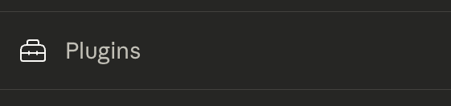
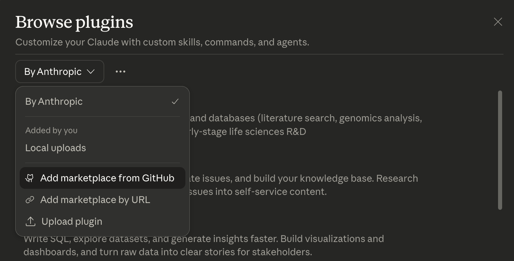
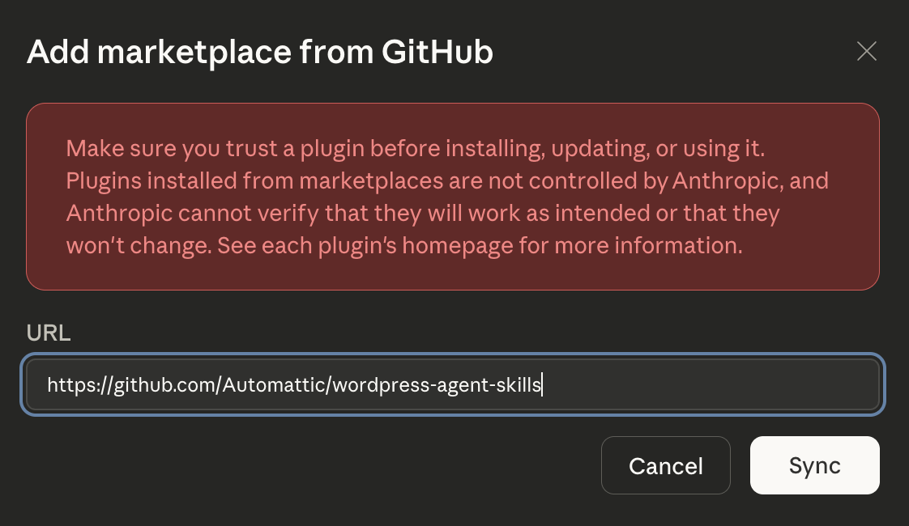
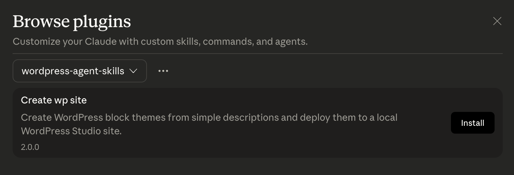

# WordPress Agent Skill Prototypes

This repository contains early prototypes of Agent Skills for building WordPress themes/sites and easily sharing them with the world. These are currently released as beta software and recommended for developers and AI enthusiasts to test and provide feedback on. The code is not production-ready and may contain bugs, security issues, and other problems. Use at your own risk.

As with all things AI, don't believe everything the model tells you.

## Quick start

### Claude Code

1. Install [WordPress Studio](https://developer.wordpress.com/studio/) and [enable the CLI](https://developer.wordpress.com/docs/developer-tools/studio/cli/) if you haven't already.
2. Install the Claude Code plugin using **one** of the options below:

   **Option A — via HTTPS**:
   ```sh
   claude plugin marketplace add https://github.com/Automattic/wordpress-agent-skills.git
   claude plugin install create-wp-site@wordpress-agent-skills
   ```

   **Option B — updating an existing plugin**: If you already have the plugin installed and want to get the latest changes, you can run:
   ```sh
   claude plugin marketplace update wordpress-agent-skills
   claude plugin update create-wp-site@wordpress-agent-skills
   ```

3. Open Claude Code in your WordPress Studio home folder (Usually `~/Studio`) and run either:

 -  The `/quick-build` command to start the quick interactive workflow for generating a WordPress block theme with an index.html landing page template and deploying it to your local Studio site.
 Or
 - The `/design-site` command for a more in-depth interactive workflow that starts with defining a design direction and style tokens, then generating initial page layouts, followed by a full custom theme build with content pages deployed to your local Studio site.

**Important** - If you have images, logos, other documents related to the site design then drag the folder containing these into the Claude Code terminal window and it will use these assets as part of the theme generation process.

### Claude Cowork

1. Install [WordPress Studio](https://developer.wordpress.com/studio/) and enable the CLI and add the MCP server to your Claude Desktop (see [`studio-mcp/README.md`](studio-mcp/README.md#pre-setup) for details)
2. Install the Cowork plugin:
    1. Open the plugins menu in Cowork at bottom of the left sidebar

       

    2. Add to marketplace from Github

       

    3. Add link to https://github.com/Automattic/wordpress-agent-skills

       

    4. Install `Create WP Site` plugin

       
3. In Cowork run the `/create-site` command to start or select it from the plugins menu

The workflow: describe your site, review specs, pick a design direction from 3 previews, then the plugin generates a full WordPress block theme and deploys it to a local Studio site.

See [`claude-cowork/wp-site-creator/README.md`](claude-cowork/wp-site-creator/README.md) for commands, skills, and details about how to manually install the plugin from your local repo.

### Studio MCP server

The MCP server gives AI assistants (Claude Desktop, Cursor, Cowork) the ability to manage local WordPress sites — create sites, write files, run WP-CLI commands, and create shareable preview links.

See [`studio-mcp/README.md`](studio-mcp/README.md) for setup and available tools.

## Disclaimer

This is early-stage experimentation. The plugins are not polished and the generated themes are not production-ready. The goal is to explore the possibilities and gather feedback on what works and what doesn't.

## What's in this repo

| Directory | What it is |
|-----------|-----------|
| [`claude-code/wp-site-creator/`](claude-code/wp-site-creator/) | Claude Code plugin — generates WordPress block themes from a description and deploys them to a local Studio site |
| [`claude-cowork/wp-site-creator/`](claude-cowork/wp-site-creator/) | Claude Cowork plugin — generates WordPress block themes from a description and deploys them to a local Studio site |
| [`studio-mcp/`](studio-mcp/) | WordPress Studio MCP server — connects Studio to AI tools via the Model Context Protocol |

## FAQS

- **Why only Claude tools?**
    The Claude Code plugin is just the start. Once the basic functionality is proven out and feedback is gathered, the next step will be to port these capabilities into other AI Agents like Codex, OpenCode, etc.
- **Why the Model Context Protocol (MCP) link to Studio?**
    The MCP link to [Studio](https://developer.wordpress.com/studio/) provides a quick and easy way of taking an AI created WordPress theme or site and deploying it to a local environment for viewing. Studio also provides a way to [share your site with others](https://developer.wordpress.com/docs/developer-tools/studio/preview-sites/), and to [sync it to WordPress.com or Pressable](https://developer.wordpress.com/docs/developer-tools/studio/sync/). To make setup easier we will be looking at other approaches that do not require the MCP server in the near future.
